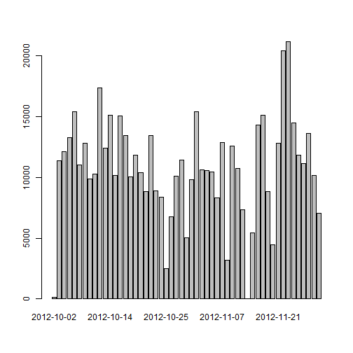
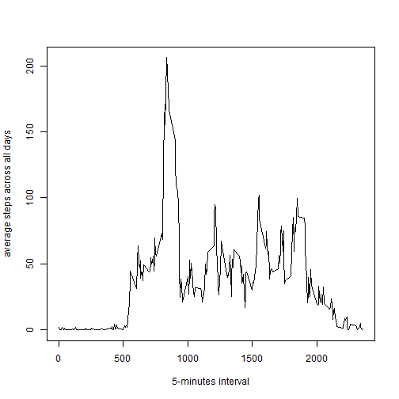
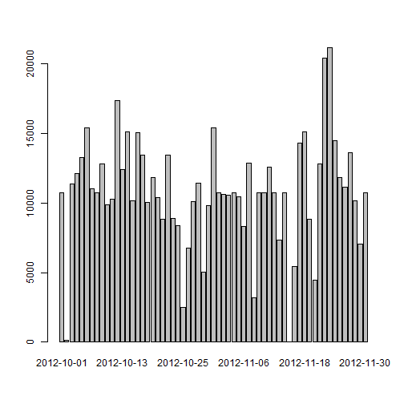
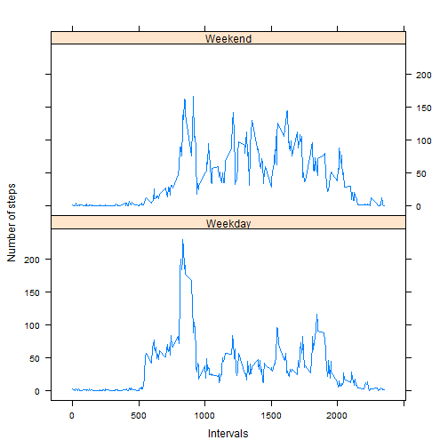

Loading and preprocessing the data
==================================


```r
new_data<-read.csv('activity.csv')

new_data[,2]<-as.Date(as.character(new_data[,2]))

new_dataclean<-new_data[with(new_data,!is.na(new_data$steps)),]
```

What is mean total number of steps taken per day?
=================================================


```r
daily_steps<-tapply(new_dataclean$steps,new_dataclean$date,sum,na.rm=TRUE)

barplot(daily_steps)
```



```r
mean(daily_steps)
```

```
## [1] 10766.19
```

```r
median(daily_steps)
```

```
## [1] 10765
```

What is the average daily activity pattern?
===========================================


```r
interval_steps<-tapply(new_dataclean$steps,new_dataclean$interval,mean,na.rm=TRUE)
intervals<-new_data$interval[1:288]
plot(intervals,interval_steps,type='l', xlab = '5-minutes interval',
     ylab = 'average steps across all days')
```



```r
joined_data<-data.frame(intervals,interval_steps)
joined_data[with(new_dataclean, interval_steps==max(interval_steps)),]
```

```
##     intervals interval_steps
## 835       835       206.1698
```

Imputing missing values
=======================


```r
new_data2<-new_data
sum(is.na(new_data2$steps))
```

```
## [1] 2304
```

```r
interval_steps2<-tapply(new_dataclean$steps,new_dataclean$interval,mean,na.rm=TRUE)

means<-as.numeric(rep(interval_steps2,288))

for(i in 1:17568){
  if(is.na(new_data2[i,1])){
    new_data2[i,1]<-means[i]
  }
  
}

daily_steps2<-tapply(new_data2$steps,new_data2$date,sum,na.rm=TRUE)

barplot(daily_steps2)
```



```r
mean(daily_steps2)
```

```
## [1] 10766.19
```

```r
median(daily_steps2)
```

```
## [1] 10766.19
```

Are there differences in activity patterns between weekdays and weekends?
=========================================================================


```r
new_data2$days<-weekdays(new_data2$date)

for(i in 1:17568){
  if(new_data2[i,4]=='Saturday'){
    new_data2[i,4]='Weekend'
  }
  else if(new_data2[i,4]=='Sunday'){
    new_data2[i,4]='Weekend'
  }
  else new_data2[i,4]='Weekday'
}
new_data2$days=as.factor(new_data2$days)

head(new_data2)
```

```
##       steps       date interval    days
## 1 1.7169811 2012-10-01        0 Weekday
## 2 0.3396226 2012-10-01        5 Weekday
## 3 0.1320755 2012-10-01       10 Weekday
## 4 0.1509434 2012-10-01       15 Weekday
## 5 0.0754717 2012-10-01       20 Weekday
## 6 2.0943396 2012-10-01       25 Weekday
```

```r
new_data2<-aggregate(data=new_data2, steps~interval+days, mean)
library(lattice)
xyplot(steps~interval | days, data=new_data2,type = 'l', layout=c(1,2), xlab = 'Intervals', ylab = 'Number of steps')
```



